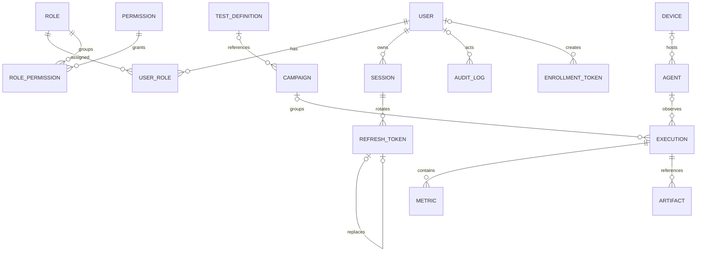

# ERD de Fase 03

IDs son UUID. Timestamps persistidos son `TIMESTAMPTZ`. Foreign keys declaran
`ON DELETE`; recursos históricos se desactivan o revocan y no usan soft delete
genérico. `version_id` aplica optimistic locking a recursos editables.

`Capability` sólo conserva identidad y versión funcional. No contiene provider,
un campo agregado `support` ni dimensiones definitivas de manifest.
