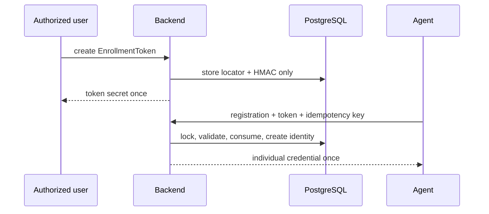

# Enrolamiento, credenciales e idempotencia

## EnrollmentToken

Formato: `wto_enr_1.<locator UUID>.<secret base64url>`. El secreto tiene 256
bits. PostgreSQL guarda sólo HMAC-SHA-256 con
`WTO_ENROLLMENT_TOKEN_HMAC_KEY`; locator no es secreto. En Fase 04 hay un uso,
expiración default 15 minutos y máxima 24 horas. Scopes: `agent.enroll` y
`agent.recover`.

La fila se bloquea con `SELECT FOR UPDATE`; reloj del servidor, expiración,
revocación, restricciones y consumo se verifican en la transacción que crea o
vincula Device/Agent y emite credential. Errores externos no distinguen token
inexistente, expirado, revocado o consumido. Rate limit usa fingerprints.



## AgentCredential y rotación

Formato: `wto_ac_1.<credential UUID>.<secret base64url>`, también con 256 bits.
Se persisten ID, agent, versión monotónica, HMAC-SHA-256 con clave independiente,
key version, estado y timestamps. Comparación usa `hmac.compare_digest`. No hay
JWT de larga duración ni secreto global; el diseño admite firma/mTLS futuro.

La credential active crea una rotación idempotente bajo lock de Agent. Se crea
una sola pending; ésta sólo autentica activación. Al demostrar posesión, una
transacción activa la nueva y revoca la anterior. Índices parciales garantizan
como máximo una active y una pending.

```mermaid
sequenceDiagram
    participant A as Agent active vN
    participant B as Backend
    participant P as PostgreSQL
    A->>B: create rotation + idempotency key
    B->>P: lock Agent; create pending vN+1
    B-->>A: pending secret once
    A->>B: activate authenticated with pending
    B->>P: pending->active; vN->revoked atomically
    B-->>A: activation metadata
```

Respuestas secretas se cifran temporalmente con AEAD y
`WTO_SECRET_REPLAY_ENCRYPTION_KEY`: sólo ciphertext, nonce, key version, expiry
y referencia idempotente. Replay máximo 15 minutos. Expirado, la misma key
devuelve `secret_replay_expired`, no reemite y expira la pending; la anterior
sigue active. Perder una active exige recovery ligado al Agent.

## Idempotencia

Key es UUID v4 lowercase y sólo aparece donde hay retry. Scope persistido:
`(principal_type, principal_id, operation_id, idempotency_key)`. Enrollment usa
token validado como principal y `operation_id` incorpora installation ID.

Fingerprint es SHA-256 de JSON validado, UTF-8, claves ordenadas y separadores
compactos. Es canonicalización determinista para payloads restringidos de Fase
04, no implementación general de RFC 8785. Authorization, cookies, secrets e
idempotency key se excluyen.

- Misma key/fingerprint: replay.
- Misma key/payload distinto: 409 `idempotency_key_reused`.
- Pending concurrente: lock advisory y de fila; luego 409
  `idempotency_in_progress` con `Retry-After: 1`.
- Pending abandonado: 15 minutos; terminal: 7 días.
- Secret replay: 15 minutos. Cleanup futuro borra replay y luego records por
  lotes; no se agrega scheduler en esta fase.

Revocar Agent bloquea su fila, revoca active/pending e invalida rotaciones. La
reactivación sólo existe mediante `agent.recover` autorizado.
