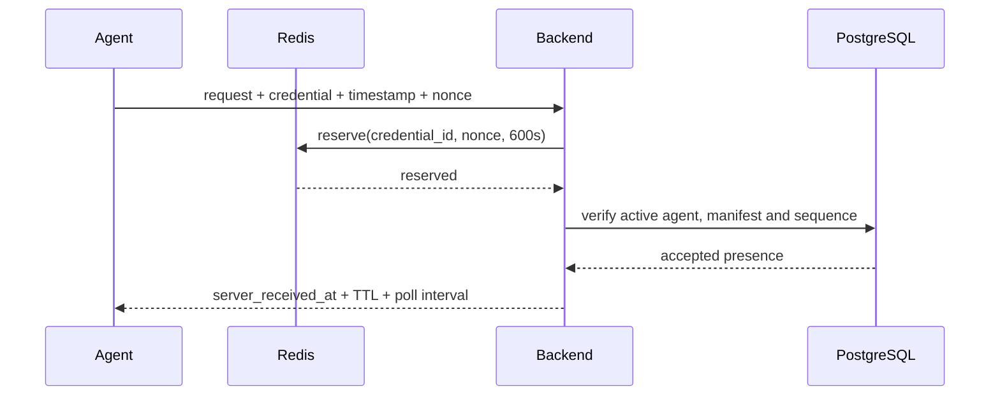

# Protocolo de agentes 1.0.0

## Autenticación y replay

User auth y agent auth son dependencias separadas. Un request de agente lleva
`Authorization: Bearer <AgentCredential>`, `X-WTO-Agent-Timestamp`,
`X-WTO-Agent-Nonce`, `X-WTO-Agent-Protocol` y `X-Correlation-ID`. Timestamp es
RFC 3339 UTC con skew máximo ±300 s. Nonce es base64url de 128 bits, único por
credential durante 600 s y reservado atómicamente en Redis. Redis inaccesible
falla cerrado con 503.

`AgentPendingCredentialAuth` sólo sirve a activación. Una credential recién
activada puede repetir esa misma activación idempotente para recuperar una
respuesta perdida; no recibe otro privilegio.

## API estable y provisional

- UserBearerAuth: crear/revocar tokens, recovery, listar/revocar metadata de
  credentials y revocar agentes.
- API v1 de agente: enrolar, crear/activar rotación, manifest, heartbeat y
  mobile presence.
- Stubs internos: task fetch, progress, result y ArtifactManifest. Demuestran
  auth, replay, revocación, límites y schemas sin scheduler, leases, uploads,
  campañas ni persistencia de resultados.

Desktop recomienda 30 s y TTL 90 s. `boot_id` separa reinicios y `sequence` es
uint64 monotónico por boot: mismo sequence/digest es replay semántico; mismo
sequence con otro cuerpo o sequence anterior devuelve 409.

Mobile publica presence puntual. La respuesta incluye `server_received_at`,
`presence_expires_at` y `poll_after_seconds`; task retrieval es HTTPS outbound
separado. Push sólo podrá notificar; FCM/APNs quedan fuera de alcance.

Agent Protocol min/max se negocia al enrolar y el header exacto se valida en
cada request. Versión o catálogo desconocido se rechaza; nunca se interpreta
como unsupported. Deprecation se anuncia por documentación/OpenAPI y requiere
coexistencia hasta el sunset de la versión anterior.
