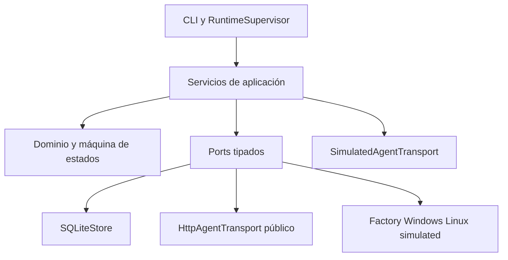

# Arquitectura del agente desktop

## Capas

El dominio contiene estados, idempotencia y modelos locales. Los ports incluyen
`PlatformAdapter`, `WifiCollector`, `NetworkController`, `ProcessRunner`,
`SecretStore`, `ServiceManager`, `AgentTransport`, `LocalStore`, `Clock`,
`RandomSource`, `CancellationToken`, `ArtifactUploader` y `Updater`.

Los imports de plataforma son diferidos. La factory importa sólo el módulo
Windows, Linux o simulated seleccionado. El core nunca importa `pywin32`,
`secretstorage`, systemd ni APIs Wi-Fi.

## Contratos públicos y locales

`HttpAgentTransport` implementa únicamente las cuatro superficies públicas de
Fase 04. No contiene métodos ni rutas para task fetch, progress, results o
artifacts. `LocalTaskEnvelope` y los estados locales más ricos no modifican ni
extienden los contratos públicos 1.0.0.

El scheduler local acepta una concurrencia configurable, uno por defecto. El
runtime productivo publica manifest y heartbeat; no consulta una API de tasks
hasta que exista un contrato público autoritativo.
