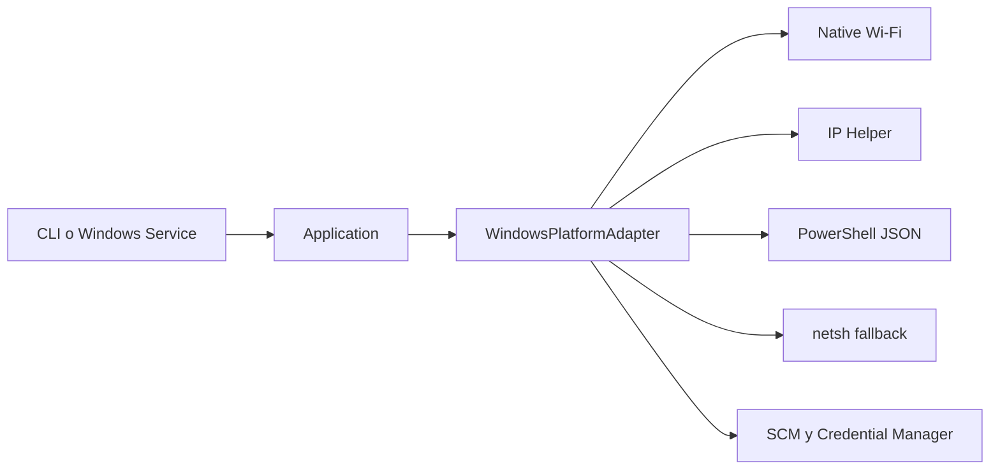

# Arquitectura Windows

`WindowsPlatformAdapter` compone collectors, control local, ProcessRunner, Credential Manager,
ServiceManager y detección de captura. El core no importa pywin32 ni `ctypes.WinDLL`.

La fusión se realiza por campo en orden Native Wi-Fi, API estructurada, PowerShell y netsh. Una
fuente parcial no invalida el snapshot. `collected_at` existe sólo en el modelo interno; no se
agrega al contrato público Metric 1.0.0.
