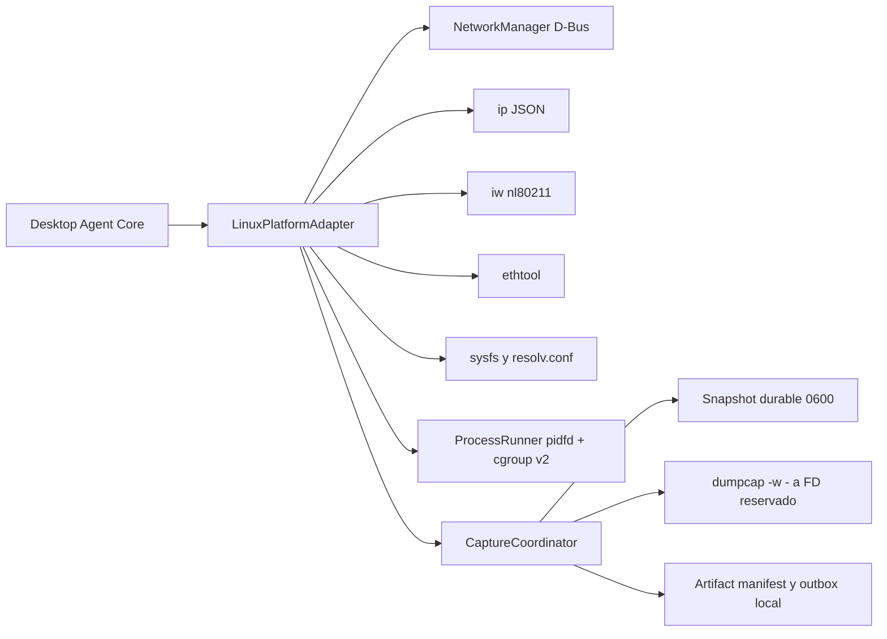

# Arquitectura del adapter Linux

## Prioridad y fusión

1. `dbus-next` consulta propiedades estructuradas de NetworkManager sobre el
   system bus. Se consulta cada dispositivo por path; una interfaz que
   desaparece no invalida las restantes.
2. `ip -details -statistics -json address show` y rutas IPv4/IPv6 aportan
   interfaces, flags administrativos, estado operativo, MTU, MAC, direcciones,
   gateway y counters.
3. `iw dev`, `iw dev INTERFACE link/info` aportan wiphy, asociación, SSID,
   BSSID, frecuencia, canal, ancho, signal y rates. Los argumentos pasan por
   modelos cerrados; no hay shell.
4. `ethtool -i` aporta driver, firmware y bus info. `sysfs` diferencia
   interfaces físicas/virtuales y conserva identificadores de chipset cuando
   existen. `/etc/resolv.conf` es fallback global de DNS.
5. `nmcli` no participa de la lectura normal; sólo respalda operaciones
   controladas de snapshot/restauración cuando NetworkManager administra la
   interfaz de captura.

La fusión es por campo. Cada valor conserva source, availability, confidence y
reason. Campos ausentes quedan `value: null`; no se sintetiza cero. Las causas
se distinguen en detalle como `unavailable`, `unsupported`,
`permission_denied`, `command_missing`, `interface_disconnected`,
`transient_failure` e `invalid_output`, mapeadas a los códigos `reason` 1.0.0
existentes.

## NetworkManager

El provider contempla daemon activo, instalado pero inactivo, servicio ausente,
system D-Bus ausente, acceso denegado, dispositivos unmanaged, varias radios y
cambios/desconexiones durante una lectura. La ausencia de NetworkManager no
detiene el agente: `ip`/`iw` continúan de forma independiente.

`active_connections` distingue `complete`, `partial` y `unavailable`. Una
consulta completa sin conexiones publica `[]` observado. Si un objeto D-Bus
desaparece o falla una property, se conservan las conexiones ya leídas, se
publica el subconjunto como `availability=unknown` y quedan `source_errors`; si
no existe ninguna lectura confiable, el valor es `null`, nunca un empty medido.
Capture Node rechaza snapshots parciales o unavailable antes del journal y de
cualquier comando mutante.

## Capabilities normativas

No se agregaron IDs locales. El manifest siempre usa el catálogo 1.0.0:

| Función local | Capability normativa | Condición para provider available |
|---|---|---|
| Inventario/asociación Linux | `wifi.connection.read` | NetworkManager D-Bus o `iw dev` consultado y validado en el ciclo actual |
| RSSI | `wifi.rssi.read` | Provider productivo validado; el valor desconectado queda unavailable |
| Scan | `wifi.scan` | No implementada en Fase 07 para evitar scan disruptivo |
| Captura IP | `capture.ip` | rol, policy, dumpcap, acceso y self-check |
| Monitor/channel/radiotap | `capture.ieee80211.monitor` | además NIC/driver, capabilities mínimas y cgroup v2 delegado |
| Flent | `traffic.latency_under_load` | policy, Flent/netperf con self-check y contención de árbol |
| Tcpreplay | `traffic.pcap.replay` | rol, policy, tool, namespace, artifacts aprobados y contención; implementación parcial simulada |
| systemd | `execution.background.continuous` | unidad instalada/activa y garantía de contención; errores quedan unavailable |

Frequency lock, radiotap y artifact staging son condiciones o métodos del
provider, no capability IDs nuevos. El contrato de enrolamiento vigente no
incluye rol: `node_role` es una policy local explícita, reflejada en las
dimensiones del manifest. Incorporar un rol autoritativo de servidor requiere
una futura evolución contractual.

## Lifecycle de procesos

Cada ejecución usa `create_subprocess_exec`, argv separado, executable absoluto,
environment mínimo, output acotado y deadline. El caller registra explícitamente
`leader_only` o `process_tree`; una omisión falla cerrado. Comandos breves y de
sólo lectura pueden aceptar líder pidfd-only. Capture Node, replay, Flent,
providers mutantes y procesos prolongados requieren un cgroup v2 privado.

Readiness crea y elimina un leaf de prueba local para verificar que el subtree
delegado permite los controles del leaf, incluido `cgroup.kill`; el mismo
provider se consulta al publicar manifest y al autorizar cada operación.

El guard queda bloqueado mientras se crea el cgroup local aleatorio, se mueve su
PID por `cgroup.procs` y se verifica membership. Recién después se registra
`release_sent`. Cleanup envía SIGTERM sólo al líder por pidfd, espera de forma
acotada, usa `cgroup.kill` para remanentes, exige `populated=0`, reapea el líder y
elimina una sola vez el cgroup vacío. No existe fallback por PID/PGID, `killpg`,
`os.kill`, `process.kill` ni `process.terminate` en el runner Linux. Sin pidfd o
subtree delegado, la operación que requiere árbol queda unavailable antes del
spawn.
